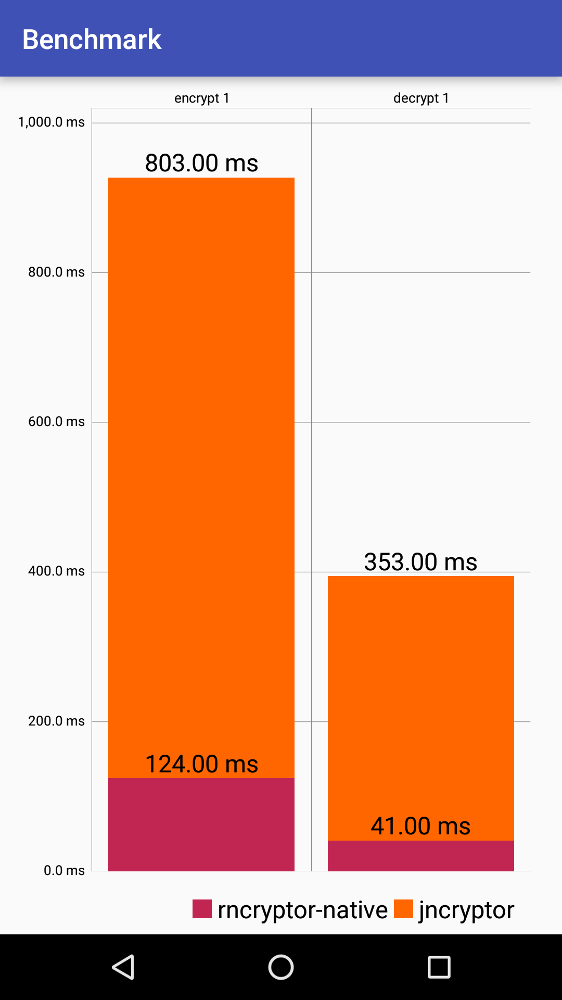

Deprecated

[](https://android-arsenal.com/details/1/3643)

## RNCryptorNative

Android JNI model implementation of Rob Napier's RNCryptor.


#### Import guide

```gradle
dependencies {
    compile 'com.github.tgio:rncryptor-native:0.0.9'
}
```

#### Usage

  ```java
  
RNCryptorNative rncryptor = new RNCryptorNative();

String encrypted = new String(rncryptor.encrypt(raw, password));

String decrypted = rncryptor.decrypt(encrypted, password)

  ```
  
  or

  ```java
  
String password = "StrongGeneratedPasswordxD";
  
RNCryptorNative.encryptAsync("test", password, new RNCryptorNative.Callback() {
    @Override
    public void done(String encrypted, Exception e) {
        System.out.println("encrypted async: " + encrypted);
    }
});

//Decrypt
RNCryptorNative.decryptAsync(encrypted, password, new RNCryptorNative.Callback() {
    @Override
    public void done(String decrypted, Exception e) {
        System.out.println("decrypted async: " + decrypted);
    }
});

//Working with files

//Encrypt

RNCryptorNative.encryptFile(new File("path/to/original"), new File("path/to/encrypted"), "password");

//Decrypt

RNCryptorNative.decryptFile(new File("path/to/encrypted"), new File("path/to/decrypted"), "password");
  ```
  
#### Benchmark:

You might know that JNCryptor (Java port for RNCryptor) already exists. But there is a huge problem - performance. This is why RNCryptorNative is better solution. Screenshots of benchmarks: 

|  |  |
  
## Credits

[Rob Napier](https://github.com/rnapier), [RNCryptor Team](https://github.com/RNCryptor), [MPAndroidChart](https://github.com/PhilJay/MPAndroidChart)
